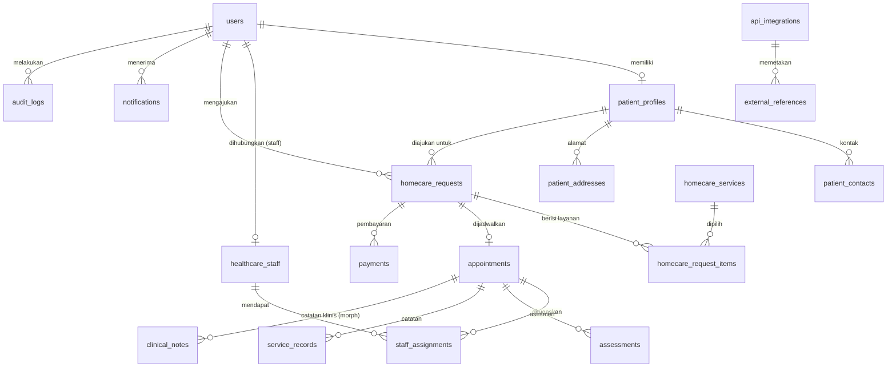

# Database Design — Soeradji Gocare

Koneksi default development: **SQLite**; produksi: **MySQL/MariaDB** (lihat `.env.example`).
Semua tabel memakai `id` (bigIncrements/uuid sesuai kebutuhan), `created_at`, `updated_at`,
dan index pada kolom status/tanggal/FK.

## ERD (konseptual)

## Tabel

| Tabel | Tujuan | Kolom kunci |
|---|---|---|
| `users` | Akun login (pasien/keluarga & petugas) | `name`, `email` (unique), `password`, `role` (enum), `phone`, `is_active` |
| `patient_profiles` | Data pasien (bisa >1 per akun: diri sendiri/keluarga) | `user_id`, `name`, `nik` (unik, nullable), `gender`, `birth_date`, `relationship`, `medical_notes` |
| `patient_contacts` | Kontak pasien/keluarga | `patient_profile_id`, `type` (phone/wa/email), `value`, `is_primary` |
| `patient_addresses` | Alamat pelayanan | `patient_profile_id`, `label`, `recipient_name`, `phone`, `address_line`, `city`, `province`, `postal_code`, `notes`, `latitude`, `longitude`, `is_primary` |
| `homecare_services` | Master layanan (tidak hardcode) | `code` (unik), `name`, `icon`, `thumbnail`, `slug` (unik), `category`, `short_description`, `description`, `duration_minutes`, `price` (Jumlah), `jasa_sarana`, `jasa_pelayanan`, `price_note`, `is_active`, `is_featured`, `sort_order` |
| `homecare_requests` | Pengajuan homecare | `code` (unik, `HC-YYYYMM-XXXX`), `user_id`, `patient_profile_id`, `patient_address_id`, `status` (enum), `complaint`, `notes`, `preferred_date`, `preferred_time_window`, `screening_*`, `verified_by/at`, `rejected_reason`, `information_request`, `total_amount`, `payment_status`, `submitted_at`, `completed_at`, `cancelled_*` |
| `homecare_request_items` | Layanan yang dipilih + tarif snapshot | `homecare_request_id`, `homecare_service_id`, `service_name` (snapshot), `quantity`, `unit_price`, `subtotal`, `notes` |
| `appointments` | Jadwal kunjungan | `homecare_request_id` (unik di v1), `status` (enum), `scheduled_at`, `estimated_duration_minutes`, `address_snapshot` (json), `checkin_at`, `checkout_at`, `notes` |
| `healthcare_staff` | Data tenaga kesehatan | `user_id` (nullable, unik), `name`, `profession` (enum), `license_number`, `specialization`, `phone`, `email`, `is_active` |
| `staff_assignments` | Penugasan petugas per kunjungan | `appointment_id`, `healthcare_staff_id`, `status` (enum), `role` (primary/support), `assigned_by`, `assigned_at` |
| `assessments` | Asesmen saat kunjungan | `appointment_id`, `healthcare_staff_id`, tekanan darah, nadi, suhu, rr, spo2, kesadaran, skala nyeri, `findings`, `payload` (json extensible), `assessed_at` |
| `service_records` | Dokumentasi pelayanan | `appointment_id`, `healthcare_staff_id`, `actions_taken`, `results`, `recommendations`, `follow_up_needed`, `started_at`, `ended_at` |
| `clinical_notes` | Catatan klinis (morph) | `noteable_type/id`, `healthcare_staff_id`/`user_id`, `type` (progress/soap/other), `content`, `recorded_at` |
| `payments` | Pembayaran | `homecare_request_id`, `method` (enum), `status` (enum), `amount`, `reference_number`, `paid_at`, `received_by`, `notes`, `gateway`, `gateway_payload` (json) |
| `notifications` | Notifikasi in-app (bawaan Laravel) | standar Laravel |
| `audit_logs` | Audit trail | `user_id`, `event`, `auditable_type/id`, `description`, `properties` (json), `ip_address`, `user_agent`, `created_at` |
| `attachments` | Dokumen/foto (morph, disk private) | `attachable_type/id`, `collection`, `uploaded_by`, `disk`, `path`, `original_name`, `mime_type`, `size` |
| `api_integrations` | Konfigurasi integrasi eksternal | `code` (unik: simrs/satusehat/payment/whatsapp/maps), `name`, `driver`, `base_url`, `is_active`, `settings` (json, encrypted cast), `last_used_at` |
| `external_references` | Mapping ID sistem eksternal | `api_integration_id`, `externalizable_type/id`, `external_id`, `payload` (json), `synced_at` |

Plus tabel bawaan: `cache`, `jobs`, `sessions`, `password_reset_tokens`,
`personal_access_tokens` (Sanctum).

## Keputusan Desain

- **Snapshot harga & nama layanan** di `homecare_request_items` agar perubahan tarif master
  tidak mengubah riwayat.
- **Snapshot alamat** (json) di `appointments` agar kunjungan tetap valid walau alamat
  pasien berubah.
- `clinical_notes` dan `attachments` polymorphic → dapat ditempel ke request, appointment,
  service record, dsb. tanpa migrasi baru.
- Kolom enum di database adalah `string` + validasi enum PHP (ramah MySQL & SQLite,
  mudah diperluas).
